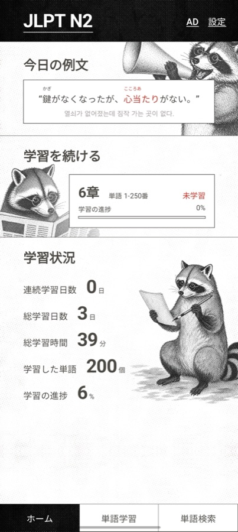
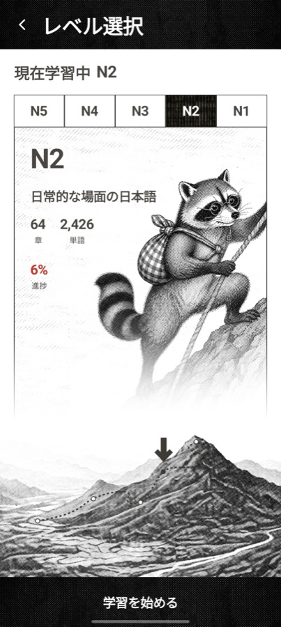
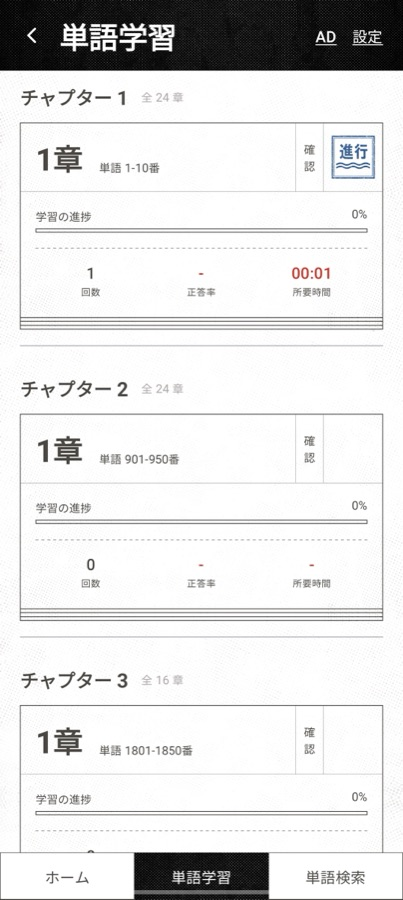
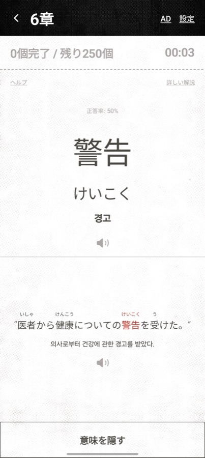
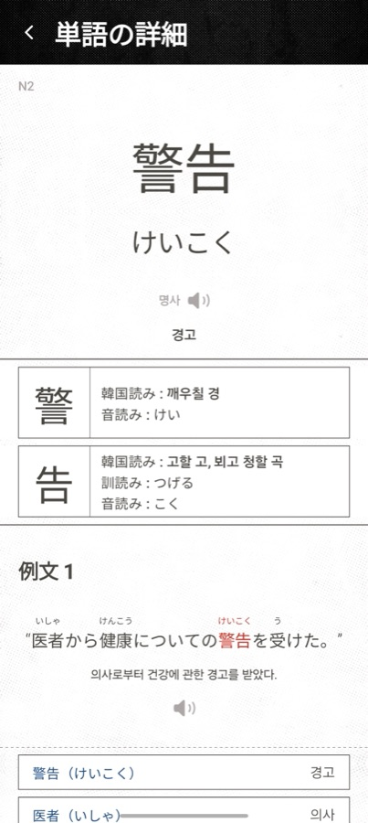
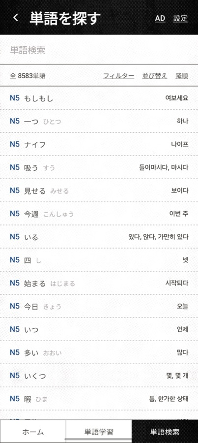
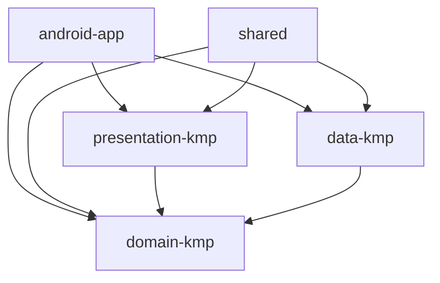
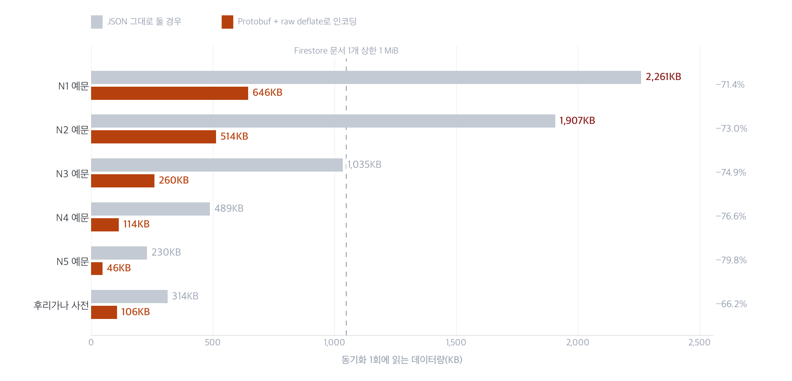
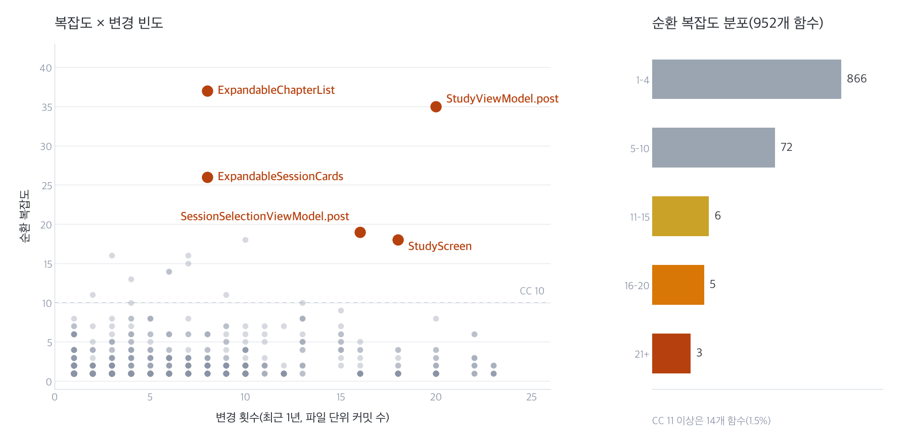

# 타비 - JLPT 단어 회독

[日本語](README.md) | **한국어**

[](https://github.com/minseonglove/jlpt-words-app/actions/workflows/ci.yml)

JLPT(일본어능력시험) N5~N1 단어를 회독 방식으로 학습하는 모바일 앱의 소스 코드입니다.
Kotlin Multiplatform과 Compose Multiplatform으로 Android / iOS의 UI를 공유하며, 양쪽 스토어에 출시해 운영하고 있습니다.

- App Store「旅 JLPT単語」: https://apps.apple.com/jp/app/id6759486729
- Google Play「타비 - JLPT 단어 회독」: https://play.google.com/store/apps/details?id=com.minseonglove.jlptwords

> [!IMPORTANT]
> **비공개 저장소에서 코드만 옮겨 온 공개용 스냅샷입니다.**
>
> - **콘텐츠 데이터(단어·예문 DB / TSV)와 Firebase 설정 파일은 포함하지 않습니다.** 콘텐츠는 앱의 핵심 자산이라 공개하지 않았습니다. 이 저장소만으로는 앱이 동작하지 않지만, 유닛 테스트와 정적 분석은 실행할 수 있습니다.

## 하이라이트

- **Compose 코드 하나로 Android / iOS 양쪽 UI를 그리고** 양쪽 스토어에서 운영하고 있습니다. iOS 쪽 Swift는 진입점 1개 파일뿐입니다.
- **콘텐츠 배포를 앱 릴리스와 분리**했습니다. 스냅샷 DB를 번들해 첫 다운로드를 생략하고, 이후에는 Firestore에서 바뀐 것만 동기화합니다.
- **예문을 Protocol Buffers + raw deflate로 인코딩**해 전송량을 JSON 대비 약 73% 줄였습니다. 예문은 급수마다 Firestore 문서 1개에 들어갑니다.
- **Compose에 없는 루비(후리가나) 조판을 직접 구현**해, MeCab으로 미리 계산한 후리가나를 모든 예문에 표시합니다.

## 스크린샷

UI를 일본어로 전환한 화면입니다.

| 홈 | 급수 선택 | 세션 선택 |
|---|---|---|
|  |  |  |
| **학습 카드** | **단어 상세** | **단어 검색** |
|  |  |  |

## 개요

- 수록: 단어 8,583개(N1 3,092 / N2 2,426 / N3 1,495 / N4 969 / N5 601), 예문 11,090개
- 단어 뜻·예문 번역은 한국어. UI는 일본어·한국어 지원
- 챕터 단위로 학습. 아는 단어 / 모르는 단어를 스와이프로 나누고, 정답률이 낮은 단어를 모은 세션도 자동 생성
- 그 밖에: 학습 통계와 연속 출석일, 오늘의 예문, 단어 검색(표기·발음·뜻 부분 일치, 급수 / 표기 필터), 한자 정보, TTS 발음 재생, 학습 알림, 리워드 광고로 24시간 광고 제거, 다크 테마

## 기술 스택

| 분류 | 사용 기술 |
|---|---|
| 언어 | Kotlin 2.4(Multiplatform), Swift(iOS 진입점만) |
| UI | Compose Multiplatform 1.11, Material 3 |
| 아키텍처 | Clean Architecture + MVI(Orbit 11) |
| DI | Koin 4.2 |
| 로컬 DB | Room 2.8(KMP) + Bundled SQLite |
| 원격 | Firebase Firestore |
| 통신 / 직렬화 | Ktor 3.5, kotlinx.serialization, Wire(Protocol Buffers) |
| 기타 | DataStore, Google Mobile Ads, Firebase Analytics / Crashlytics |
| 품질 | ktlint, detekt, GitHub Actions |

## 아키텍처

### 모듈 구성

```
android-app/       Android 앱
ios-app/           iOS 앱
shared/            iOS 진입 모듈
presentation-kmp/  UI, ViewModel
domain-kmp/        UseCase, 엔티티
data-kmp/          Repository 구현, 데이터 소스
scripts/           콘텐츠 파이프라인
```



### UI 공유

- 화면은 모두 `presentation-kmp`의 `commonMain`에 있으며, Android와 iOS가 같은 Compose 코드를 사용합니다. 네이티브 쪽은 진입점뿐이며, iOS 앱의 Swift 소스는 `JlptWordsApp.swift` 1개 파일입니다.
- 플랫폼별 코드는 광고·TTS·클립보드 같은 SDK 호출에만 두고 `expect` / `actual`로 분리했습니다.
- iOS의 Firebase와 Google Mobile Ads는 Gradle의 `swiftPMDependencies {}`로 SwiftPM에서 받아 cinterop합니다.

### MVI(Orbit)와 Clean Architecture

- 화면마다 `Screen` / `ViewModel` / `State` / `SideEffect`를 둡니다.
- State의 컬렉션은 Immutable 컬렉션을 씁니다.
- `compose_stability.conf`로 domain 엔티티를 stable로 지정해 불필요한 리컴포지션을 줄였습니다.
- `domain-kmp`는 프레임워크에 의존하지 않고, `presentation-kmp`는 `domain-kmp`에만 의존합니다.

## 설계 포인트

### 1. 콘텐츠 배포와 앱 배포의 분리

단어·예문·후리가나 사전·한자 정보는 Firestore에서 배포합니다.
콘텐츠 수정은 업로드 스크립트로 반영되며, 앱 릴리스를 거치지 않습니다.

앱은 급수·종류별 마지막 동기화 시각을 Firestore의 `content_update_date`와 비교해 바뀐 것만 다시 받습니다.

### 2. Protocol Buffers + raw deflate로 전송량 절감

예문과 후리가나 사전은 Wire(protobuf)로 직렬화하고 raw deflate로 압축해, Firestore 문서의 `bytes` 필드 1개에 저장합니다.



| 데이터 | 같은 내용의 JSON(공백 없음) | protobuf + deflate | 절감 |
|---|---:|---:|---:|
| 예문(전 급수, 후리가나 포함) | 5.92 MB | 1.58 MB | 약 73% |
| 후리가나 사전 | 314 KB | 106 KB | 약 66% |

- 공개 시점의 데이터로 측정한 값입니다.
- Firestore 문서 크기 상한(1 MiB)에도 대응합니다. N1 예문은 JSON으로 2.26 MB, N2는 1.91 MB라 상한을 넘지만, 압축하면 646 KB / 514 KB로 급수마다 문서 1개에 들어갑니다. 900 KB를 넘으면 문서를 나눠 저장합니다.
- 업로드 쪽 protobuf 인코더는 Python으로 구현했고, 그 출력을 앱의 Kotlin 테스트에서 디코드해 두 구현이 일치하는지 확인합니다.

### 3. 스냅샷 DB 번들로 첫 다운로드 생략

- 콘텐츠를 미리 적재한 SQLite DB를 앱에 번들합니다. 첫 실행 때 이 DB를 복사하고, DB에 기록된 스냅샷 날짜를 동기화 기준으로 삼아 처음 전체 다운로드를 생략합니다.
- 복사는 임시 파일에 쓴 뒤 rename해서, 도중에 크래시가 나도 깨진 DB가 남지 않게 했습니다.
- 스냅샷은 `PrepopulatedDbGenerator`가 앱과 같은 DAO를 재사용해 TSV로부터 생성합니다. 쓰기 경로를 앱과 공유하므로 스키마와 데이터가 어긋나기 어렵습니다.

### 4. complexityReport — 복잡도 × 변경 빈도로 개선 우선순위 결정

```bash
./gradlew complexityReport
```

- 모든 모듈에 detekt를 실행하고, `scripts/complexity/report.py`가 함수별 순환 복잡도·인지 복잡도·길이를 집계해 분포·모듈별 요약·상위 랭킹을 출력합니다.
- `--hotspot`에서는 복잡도에 git 변경 횟수(기본값은 최근 1년)를 곱해, "복잡하면서 자주 손대는" 함수부터 개선 대상을 정합니다.
- detekt는 계측이 목적이라 위반이 있어도 빌드를 멈추지 않도록 설정했습니다.
- 공개 시점에 952개 함수를 집계했고, 91%가 복잡도 1~4였습니다. 이 공개 저장소는 이력을 잘라냈기 때문에 여기서 `--hotspot`을 실행해도 변경 횟수는 의미가 없습니다. 비공개 저장소의 이력으로 집계한 결과를 `docs/complexity/2026-09-17.csv`에 남겼고, 아래 그림은 그것을 그린 것입니다.



### 5. 콘텐츠 생성 파이프라인(`scripts/`, 코드만)

| 경로 | 내용 |
|---|---|
| `generate_examples.py` | LLM으로 예문 초안을 만드는 배치 파이프라인. 구상 → TSV 정리 2단계, 체크포인트로 재개 |
| `highlight_level.py` | 예문에서 표제어가 활용된 부분을 LLM으로 찾아 `*…*`로 표시 |
| `combine_output.py` 외 | LLM 출력 형식 오류 복구·병합·검증 |
| `furigana/` | MeCab(fugashi) + UniDic으로 예문 후리가나를 미리 계산하고, 큐레이션한 토큰의 발음과 대조해 보정 |
| `firestore_upload/` | TSV 파싱, protobuf 인코딩, Firestore 반영과 검증([README](scripts/firestore_upload/README.md)) |

### 6. Compose에 없는 루비(후리가나) 조판 직접 구현

- Compose에는 HTML `<ruby>`에 해당하는 기능이 없고 `AnnotatedString`으로도 글자 위에 읽기를 올릴 수 없습니다. `RubyExampleText`는 예문을 `FlowRow`에 셀 단위로 배치하되, 후리가나가 있는 구간은 1셀, 없는 구간은 글자당 1셀로 나눠 자연스러운 줄바꿈을 얻습니다.
- 루비 칸 높이와 본문 베이스라인은 `TextMeasurer`로 CJK 기준 폰트의 메트릭을 재서 맞추고, 학습 대상 단어는 강조색으로 표시합니다. 정렬 회귀는 스크린샷 테스트(`RubyExampleTextAlignmentTest`)로 막습니다.
- 후리가나는 앱에서 사전을 찾지 않고 파이프라인에서 MeCab으로 미리 계산해 데이터에 포함합니다. 방식 선정 과정(예문 토큰만으로는 한자의 45.7%만 커버, 전역 사전은 읽기가 둘 이상인 표제어가 207개 등)은 [docs/example_furigana_design.md](docs/example_furigana_design.md)에 정리했습니다.

## 빌드와 테스트

```bash
# 유닛 테스트(commonTest를 JVM / Android host에서 실행)
./gradlew :domain-kmp:jvmTest :domain-kmp:testAndroidHostTest \
          :data-kmp:testAndroidHostTest :presentation-kmp:testAndroidHostTest \
          --init-script .github/ci/exclude-content-tests.init.gradle.kts

# 복잡도 리포트
./gradlew complexityReport

# 업로드 파이프라인 테스트
cd scripts/firestore_upload && python -m pytest test_parsing.py test_example_blob.py

# 후리가나 생성의 순수 함수 테스트(MeCab 불필요)
cd scripts/furigana && python -m pytest test_furigana_core.py
```

- 테스트는 Kotlin 189개(domain-kmp 55 / data-kmp 54 / presentation-kmp 71 / android-app instrumented 9), Python 41개(firestore_upload 22 / furigana 19)입니다. Room 마이그레이션 테스트, 루비 조판 스크린샷 테스트, Python 인코더 출력을 Kotlin 디코더로 읽는 골든 blob 테스트를 포함합니다.
- `scripts/furigana/test_generate_furigana.py`는 fugashi + UniDic이 필요합니다(`pip install -r requirements.txt && python -m unidic download`).
- 앱을 빌드하려면 `android-app/google-services.json.example`과 `ios-app/ios-app/GoogleService-Info.plist.example`을 참고해 자신의 Firebase 프로젝트 설정 파일을 준비해야 합니다. 다만 번들용 스냅샷 DB(`*.db`)도 포함하지 않았기 때문에, Android는 빌드돼도 실행 후 단어가 표시되지 않고, iOS Xcode 프로젝트는 `jlpt_words_prepopulated.db`를 참조하므로 파일을 준비하지 않으면 빌드되지 않습니다.

## CI

GitHub Actions(`.github/workflows/ci.yml`)에서 다음을 실행합니다.

- Kotlin: 유닛 테스트(위 4개 태스크)와 `complexityReport`
- Python: 업로드 파이프라인의 파서와 protobuf 인코더 테스트

**CI에서 제외한 테스트:** `PrepopulatedDbGenerator` — 콘텐츠 TSV로 스냅샷 DB를 생성하는 작업이라, TSV가 없는 이 저장소에서는 실행할 수 없기 때문입니다(`.github/ci/exclude-content-tests.init.gradle.kts`).

## 라이선스

코드는 열람용입니다. 라이선스는 부여하지 않았습니다.
