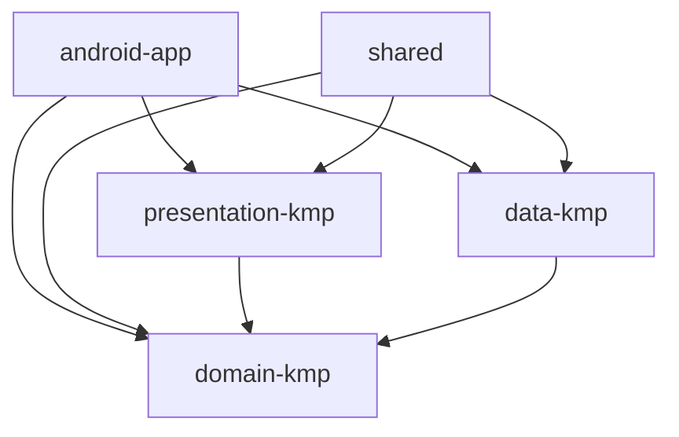
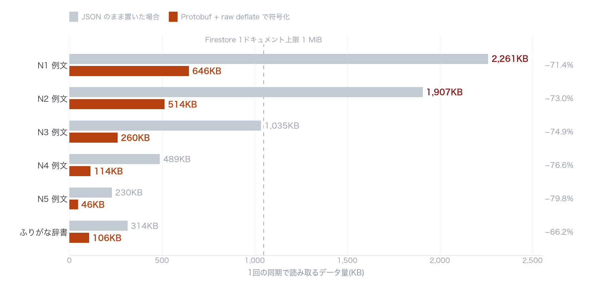
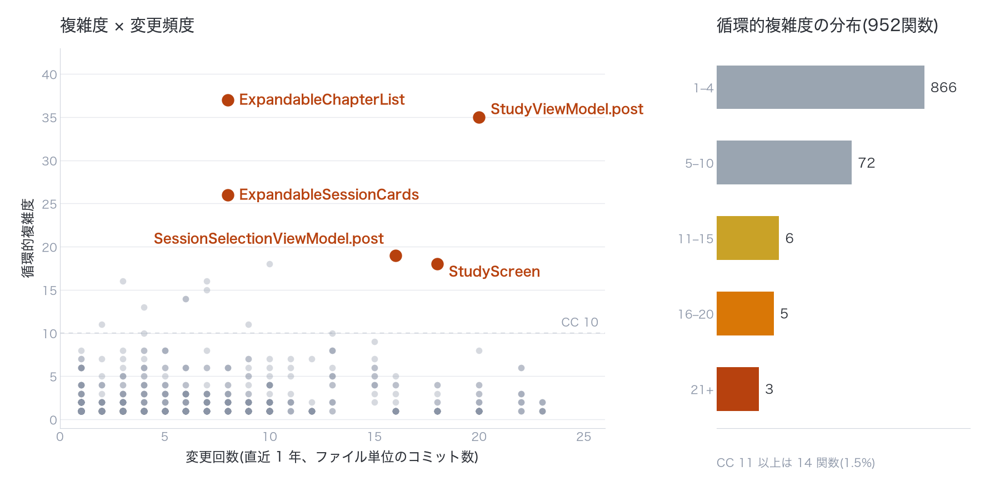

# 旅 JLPT単語

**日本語** | [한국어](README.ko.md)

[](https://github.com/minseonglove/jlpt-words-app/actions/workflows/ci.yml)

JLPT(日本語能力試験)N5〜N1 の単語を周回学習するモバイルアプリのソースコードです。
Kotlin Multiplatform と Compose Multiplatform で Android / iOS の UI を共通化し、両ストアで公開・運用しています。

- App Store「旅 JLPT単語」: https://apps.apple.com/jp/app/id6759486729
- Google Play「타비 - JLPT 단어 회독」: https://play.google.com/store/apps/details?id=com.minseonglove.jlptwords

> [!IMPORTANT]
> **このリポジトリは、非公開リポジトリからコードだけを切り出した公開用スナップショットです。**
>
> - **コンテンツデータ(単語・例文の DB / TSV)と Firebase 設定ファイルは含めていません。** コンテンツはアプリの中核資産のため、公開対象から外しています。このリポジトリ単体ではアプリとして動作しませんが、ユニットテストと静的解析は実行できます。
> - コード内のコメントとテスト名は韓国語です。

## ハイライト

- **1 つの Compose コードで Android / iOS 両方の UI を描画**し、両ストアで運用しています。iOS 側の Swift はエントリポイントの 1 ファイルだけです。
- **コンテンツの配信をアプリのリリースから分離**しています。スナップショット DB を同梱して初回ダウンロードを省き、以後は Firestore から更新分だけを同期します。
- **例文を Protocol Buffers + raw deflate で符号化**し、転送量を JSON 比で約 73% 削減しました。例文はレベルごとに Firestore ドキュメント 1 つに収まります。
- **Compose にないルビ(ふりがな)組版を自前で実装**し、MeCab で事前計算したふりがなを全例文に表示します。

## スクリーンショット

| ホーム | レベル選択 | セッション選択 |
|---|---|---|
|  |  |  |
| **学習カード** | **単語詳細** | **単語検索** |
|  |  |  |

## 概要

- 収録: 単語 8,583 語(N1 3,092 / N2 2,426 / N3 1,495 / N4 969 / N5 601)、例文 11,090 文
- 単語の意味・例文の訳は韓国語。UI は日本語・韓国語に対応
- チャプター単位で学習。知っている / 知らないをスワイプで振り分け、正答率の低い単語を集めたセッションも自動生成
- そのほか: 学習統計と連続学習日数、今日の例文、単語検索(表記・読み・意味の部分一致、レベル / 表記フィルター)、漢字情報、TTS による発音再生、学習リマインダー、リワード広告による 24 時間の広告非表示、ダークテーマ

## 技術スタック

| 分類 | 採用技術 |
|---|---|
| 言語 | Kotlin 2.4(Multiplatform)、Swift(iOS のエントリポイントのみ) |
| UI | Compose Multiplatform 1.11、Material 3 |
| アーキテクチャ | Clean Architecture + MVI(Orbit 11) |
| DI | Koin 4.2 |
| ローカル DB | Room 2.8(KMP)+ Bundled SQLite |
| リモート | Firebase Firestore |
| 通信 / シリアライズ | Ktor 3.5、kotlinx.serialization、Wire(Protocol Buffers) |
| その他 | DataStore、Google Mobile Ads、Firebase Analytics / Crashlytics |
| 品質 | ktlint、detekt、GitHub Actions |

## アーキテクチャ

### モジュール構成

```
android-app/       Android アプリ
ios-app/           iOS アプリ
shared/            iOS アプリの入口となるモジュール
presentation-kmp/  UI、ViewModel
domain-kmp/        UseCase、エンティティ
data-kmp/          Repository 実装、データソース
scripts/           コンテンツパイプライン
```



### UI の共通化

- 画面はすべて `presentation-kmp` の `commonMain` にあり、Android と iOS で同じ Compose コードを使います。ネイティブ側はエントリポイントだけで、iOS アプリの Swift ソースは `JlptWordsApp.swift` の 1 ファイルです。
- プラットフォーム固有のコードは広告・TTS・クリップボードなど SDK を呼び出す部分に限定し、`expect` / `actual` で分離しています。
- iOS の Firebase と Google Mobile Ads は、Gradle の `swiftPMDependencies {}` で SwiftPM から取得して cinterop しています。

### MVI(Orbit)と Clean Architecture

- 画面ごとに `Screen` / `ViewModel` / `State` / `SideEffect` を置いています。
- State のコレクションには Immutable コレクションを使っています。
- `compose_stability.conf` で domain のエンティティを stable に指定し、不要な再コンポーズを抑えています。
- `domain-kmp` はフレームワークに依存せず、`presentation-kmp` は `domain-kmp` だけに依存します。

## 設計のポイント

### 1. コンテンツ配信とアプリ配信の分離

単語・例文・ふりがな辞書・漢字情報は Firestore から配信します。
コンテンツの修正はアップロードスクリプトで反映でき、アプリのリリースは不要です。

アプリはレベル・種類ごとの最終同期日時を Firestore の `content_update_date` と比べ、更新されたものだけを再取得します。

### 2. Protocol Buffers + raw deflate による転送量の削減

例文とふりがな辞書は Wire(protobuf)でシリアライズして raw deflate で圧縮し、Firestore ドキュメントの 1 つの `bytes` フィールドに保存しています。



| データ | 同内容の JSON(空白なし) | protobuf + deflate | 削減 |
|---|---:|---:|---:|
| 例文(全レベル、ふりがな含む) | 5.92 MB | 1.58 MB | 約 73% |
| ふりがな辞書 | 314 KB | 106 KB | 約 66% |

- 公開時点のデータで計測した値です。
- Firestore のドキュメントサイズ上限(1 MiB)への対策にもなっています。N1 の例文は JSON だと 2.26 MB、N2 は 1.91 MB で上限を超えますが、圧縮後は 646 KB / 514 KB に収まり、各レベル 1 ドキュメントで済んでいます。900 KB を超える場合はドキュメントを分割して保存します。
- アップロード側の protobuf エンコーダは Python で実装し、その出力をアプリの Kotlin テストでデコードして、両方の実装が一致することを確認しています。

### 3. スナップショット DB の同梱による初回ダウンロードの省略

- コンテンツを事前投入した SQLite DB をアプリに同梱しています。初回起動時にこの DB をコピーし、DB に記録されたスナップショット日付を同期の基準にすることで、初回の全件ダウンロードを省きます。
- コピーは一時ファイルに書いてから rename し、途中でクラッシュしても壊れた DB が残らないようにしています。
- スナップショットは `PrepopulatedDbGenerator` がアプリと同じ DAO を再利用して TSV から生成します。書き込み経路をアプリと共有するため、スキーマとデータのずれが起きにくくなっています。

### 4. complexityReport — 複雑度 × 変更頻度で改修の優先順位を決める

```bash
./gradlew complexityReport
```

- 全モジュールで detekt を実行し、`scripts/complexity/report.py` が関数ごとの循環的複雑度・認知的複雑度・長さを集計して、分布・モジュール別の要約・上位ランキングを出力します。
- `--hotspot` では、複雑度に git 上の変更回数(既定は直近 1 年)を掛け合わせ、「複雑で、かつ頻繁に手が入る」関数から改修対象を決めます。
- detekt は計測が目的のため、違反があってもビルドを止めない設定です。
- 公開時点では 952 関数を集計し、91% が複雑度 1〜4 でした。この公開リポジトリは履歴を切り詰めているため、ここで `--hotspot` を実行しても変更回数は意味を持ちません。非公開リポジトリの履歴で集計した結果を `docs/complexity/2026-09-17.csv` に残しており、下の図はそれを描いたものです。



### 5. コンテンツ生成パイプライン(`scripts/`、コードのみ)

| パス | 内容 |
|---|---|
| `generate_examples.py` | LLM で例文の下書きを作るバッチパイプライン。構想 → TSV 整形の 2 段構成、チェックポイントから再開可能 |
| `highlight_level.py` | 例文中で見出し語が使われている箇所を、活用形も含めて LLM で特定し、`*…*` でマーク |
| `combine_output.py` ほか | LLM 出力の列崩れの修復・結合・検証 |
| `furigana/` | MeCab(fugashi)+ UniDic で例文のふりがなを事前計算し、キュレーション済みトークンの読みと突き合わせて補正 |
| `firestore_upload/` | TSV のパース、protobuf エンコード、Firestore への反映と検証([README](scripts/firestore_upload/README.md)、韓国語) |

### 6. Compose にないルビ(ふりがな)組版の自前実装

- Compose には HTML の `<ruby>` に相当する機能がなく、`AnnotatedString` でも文字の上に読みを置けません。`RubyExampleText` は例文を `FlowRow` にセル単位で並べ、ふりがな付きの区間は 1 セル、ふりがな無しの区間は 1 文字 1 セルに分けて、自然な折り返しを得ています。
- ルビ欄の高さと本文のベースラインは `TextMeasurer` で CJK 基準フォントの寸法を測って揃え、学習対象の単語は強調色で表示します。整列の回帰はスクリーンショットテスト(`RubyExampleTextAlignmentTest`)で防いでいます。
- ふりがな自体はアプリで辞書引きせず、パイプラインで MeCab により事前計算してデータに含めます。方式選定の経緯(例文のトークンだけでは漢字の 45.7% しか覆えない、全域辞書では読みが複数ある見出し語が 207 語ある、など)は [docs/example_furigana_design.md](docs/example_furigana_design.md) にまとめています(韓国語)。

## ビルドとテスト

```bash
# ユニットテスト(commonTest を JVM / Android host で実行)
./gradlew :domain-kmp:jvmTest :domain-kmp:testAndroidHostTest \
          :data-kmp:testAndroidHostTest :presentation-kmp:testAndroidHostTest \
          --init-script .github/ci/exclude-content-tests.init.gradle.kts

# 複雑度レポート
./gradlew complexityReport

# アップロードパイプラインのテスト
cd scripts/firestore_upload && python -m pytest test_parsing.py test_example_blob.py

# ふりがな生成の純粋関数テスト(MeCab 不要)
cd scripts/furigana && python -m pytest test_furigana_core.py
```

- テストは Kotlin 189 件(domain-kmp 55 / data-kmp 54 / presentation-kmp 71 / android-app の instrumented 9)、Python 41 件(firestore_upload 22 / furigana 19)です。Room のマイグレーションテスト、ルビ組版のスクリーンショットテスト、Python エンコーダの出力を Kotlin デコーダで読むゴールデン blob テストを含みます。
- `scripts/furigana/test_generate_furigana.py` は fugashi + UniDic が必要です(`pip install -r requirements.txt && python -m unidic download`)。
- アプリをビルドするには、`android-app/google-services.json.example` と `ios-app/ios-app/GoogleService-Info.plist.example` をもとに自分の Firebase プロジェクトの設定ファイルを用意する必要があります。ただし同梱用のスナップショット DB(`*.db`)も含めていないため、Android はビルドできても起動後に単語は表示されず、iOS の Xcode プロジェクトは `jlpt_words_prepopulated.db` を参照しているためファイルを用意しないとビルドできません。

## CI

GitHub Actions(`.github/workflows/ci.yml`)で次を実行しています。

- Kotlin: ユニットテスト(上記 4 タスク)と `complexityReport`
- Python: アップロードパイプラインのパーサーと protobuf エンコーダのテスト

**CI で除外しているテスト:** `PrepopulatedDbGenerator` — コンテンツ TSV からスナップショット DB を生成するテストのため、TSV を含まないこのリポジトリでは実行できません(`.github/ci/exclude-content-tests.init.gradle.kts`)。

## ライセンス

コードは閲覧用です。ライセンスは付与していません。
